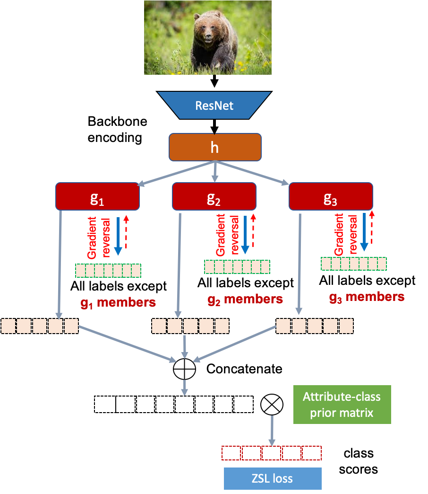

## gAL

Addressing Target Shift in Zero-shot Learning using Grouped Adversarial Learning

#### Abstract

Zero-shot learning (ZSL) algorithms typically work by exploiting attribute correlations to be able to make predictions in unseen classes. However, these correlations do not remain intact at test time in most practical settings and the resulting change in these correlations lead to adverse effects on zero-shot learning performance. In this paper, we present a new paradigm for ZSL that: (i) utilizes the class-attribute mapping of unseen classes to estimate the change in target distribution (target shift), and (ii) propose a novel technique called grouped Adversarial Learning (gAL) to reduce negative effects of this shift. Our approach is widely applicable for several existing ZSL algorithms, including those with implicit attribute predictions. We apply the proposed technique (gAL) on three popular ZSL algorithms: ALE, SJE, and DEVISE, and show performance improvements on 4 popular ZSL datasets: AwA2, aPY, CUB and SUN. We obtain SOTA results on SUN and aPY datasets and achieve comparable results on AwA2.



#### Requirements and Setup

```
conda create --name env_name --file requirements.txt
bash setup.sh
```

One more file needs to be downloaded from [here](http://www.vision.caltech.edu/visipedia-data/CUB-200-2011/CUB_200_2011.tgz). Under the `attributes/` folder, there should be a file `image_attribute_labels.txt`. Put that in `./CUB/attributes/` folder.

#### Baselines

For implementation of baseline algorithms (ALE, SJE, DEVISE), please refer to [this repo](https://github.com/mvp18/Popular-ZSL-Algorithms).

#### Code

Each dataset folder above has very similar code structure overall. Details about each command line arguments are provided at the bottom of each `main.py` file. For running experiments:

```
python main.py -zsl_loss [eszsl/ale/sje/devise] -mr [Margin for ale/sje/devise] -cls [NUM_GROUPS] -opt 0 -lsb [LAYER CONFIG B/W INPUT AND GROUP HEADS] -lsa [LAYER CONFIG GROUP HEADS ONWARDS] -l2 [L2 WEIGHT DECAY] -dr [DROPOUT] -bs [BATCH SIZE] -lr [LEARNING RATE] -advb [0/2] -aw [LAMBDA VALUE] -ds [gbu/cs]
```

#### Results

|**Method**|**aPY**|**AWA2**|**CUB**|**SUN**|
|:--|:------|:-------|:------|:------|
|DAP|33.8|46.1|40.0|39.9|
|IAP|36.6|35.9|24.0|19.4|
|CONSE|26.9|44.5|34.3|38.8|
|CMT|28.0|37.9|34.6|39.9|
|SSE|34.0|61.0|43.9|51.5|
|LATEM|35.2|55.8|49.3|55.3|
|ESZSL|38.3|58.6|53.9|54.5|
|ALE|39.7|62.5|54.9|58.1|
|DEVISE|39.8|59.7|52.0|56.5|
|SJE|32.9|61.9|53.9|53.7|
|SYNC|23.9|46.6|55.6|56.3|
|SAE|8.3|54.1|33.3|40.3|
|GFZSL|38.4|63.8|49.3|60.6|
|SP-AEN|24.1|58.5|55.4|59.2|
|f-CLSWGAN|–|–|61.5|62.1|
|QFZSL|–|63.5|58.8|56.2|
|PSR|38.4|63.8|56.0|61.4|
|Kai et al.|38.0|**71.1**|54.4|62.6|
|DLFZRL|**46.7**|70.3|**61.8**|61.3|
|CDL|43.0|–|54.5|**63.6**|
|ALE*|32.8|52.9|50.0|61.9|
|**ALE-gAL**|38.3|58.2|52.3|62.2|
|DEVISE*|33.3|57.7|44.1|55.7|
|**DeViSE-gAL**|38.9|59.4|51.7|57.4|
|SJE*|32.9|58.3|49.4|53.5|
|**SJE-gAL**|40.5|62.2|53.2|60.3|
|softmax|33.8|55.4|50.1|61.7|
|**softmax-gAL**|40.0|62.1|52.2|60.8|

#### 🎓 Cite

If this code was helpful for your research, consider citing:

```bibtex
@article{chemmengath2020addressing,
  title={Addressing target shift in zero-shot learning using grouped adversarial learning},
  author={Chemmengath, Saneem Ahmed and Paul, Soumava and Bharadwaj, Samarth and Samanta, Suranjana and Sankaranarayanan, Karthik},
  journal={arXiv preprint arXiv:2003.00845},
  year={2020}
}
```

